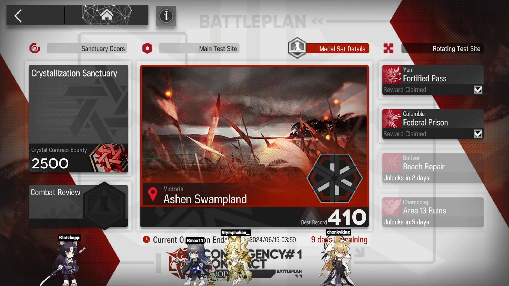

# Overview 
This is a twitch bot to allow viewers to play with an Arknights chibi on the screen by 
issuing `!chibi` commands in chat. You can use a hosted bot `StymTwitchBot` or you
can run the bot locally on your machine so that all network requests only happen
on your own machine.

Visit https://akchibibot.stymphalian.top/ to get started.



# Example Commands
Command Name | Description
-----------|-----------------------
!chibi help | Displays a help message in chat for how to use the bot
!chibi Amiya | Changes the User's current chibi to Amiya. The bot does fuzzy matching on the operator's names.
!chibi skins | Lists the available skins for the chibi. `default` is the operators normal e0 skin. Other available skins are identified by the fashion brand (i.e epoque, winter, etc)
!chibi anims | Lists the available animations for the chibi. Normal idle animations are `Relax`, `Idle`, `Sit` and `Move`. Operators with skins also have a `Special` animation that can be played.
!chibi face <front,back> | Only works in battle stance. Make the chibi face forward or backwards.
!chibi stance <base,battle> | Set the chibi to their base model (ie. the one which walk around the factory/dorms) or the battle map model
!chibi skin epoque | Change the skin to `epoque` or any other skin name.
!chibi play Attack | Change the animation the chibi currently plays. The animation loops forever.
!chibi walk <?number> | Have the chibi walk back and forth across the screen. Optionally specify a number between 0 and 1.0 for the chibi to walk to that part of the screen.
!chibi enemy The Last Steam Knight | Change the chibi into one of the enemies in the game. You can also use the enemies "code". `!chibi enemy B4` is equivalent to `!chibi enemy Originium Slug`. You can find all the enemy codes from [Arknights Wiki](https://arknights.wiki.gg/wiki/Enemy/Normal)
!chibi speed 2.0 | change the speed in which an animation is played (min 0.1, max 5.0)
!chibi who Rock | Ask the bot for operators/enemies which match the given name.
!chibi size 0.5 | Change the size/scale of the chibi. (min 0.5, max 1.5). There is still a maximum pixel size limitation on the chibi (350px)
!chibi velocity 1.2 | For when the chibi is walking around change the movement speed of the chibi (min 0.1, max 2). Use !chibi velocity default to change back to a default speed.
!chibi <save, unsave> | Save the current chibi as your preferred chibi. When you join a stream the saved chibi will be loaded with the same skin, animation, etc. Use `!chibi unsave` to clear out your preferences.

# Quick Start - Hosted
Have the twich bot directly connect to your chat by using a hosted bot.
1. Open up OBS and add a `Browser` source to your stream.
2. Set the URL to `https://akchibibot.stymphalian.top/room/?channelName=REPLACE_ME`
3. Change the `REPLACE_ME` part of the channelName (lowercase) to your own channel (ie. `?channelName=stymphalian2__`). 
4. Set the width and height to 1920x1080
5. A chibi should now be walking around.
6. Open up your twitch chat and start typing in commands

# Quick Start - Development 
Run the twitch bot locally on your own machine and attached to your own twitch account.

1. Download this repository and open up a window to it
2. Open up a command-prompt/terminal window in that directory (i.e C:/Users/Stymphalian/Downloads/ak_chibi_bot/)
by right clicking and selecting (open in command prompt/terminal).
5. You now need register the bot to your channel. Follow the instructions from [Authentication](#Authentication)
6. Follow the setting up Development environment instructions from [README_DEV.md](README_DEV.md)

# Additional Notes
1. You can change the width/height of the `/room/` by providing extra query parameters in the URL.
   For example: `https://akchibibot.stymphalian.top/room/?channelName=REPLACE_ME&width=1080&height=720`
   will make the room have size 1080x720 pixels instead of the normal 1920x1080px
2. You can change settings related to how your bot handles (!chibi size, !chibi speed, !chibi velocity) 
   commands by going to `https://akchibibot.stymphalian.top/settings/`.
   On that page you can modify the min/max values which are accepted by the commands.

# For Developers
I develop using Docker and Docker compose.
For some commentary on the architecture and layout of the program see [README_DEV.md](README_DEV.md)

### Downloading
```
git clone https://github.com/Stymphalian/ak_chibi_bot
```

### Authentication
To connect to your twitch you need to register the bot through twitch dev 
[console](https://dev.twitch.tv/console).
Please read the twitch [documentation](https://dev.twitch.tv/docs/authentication/register-app/).
Set the Oauth Redirect URL to `http://localhost:8080`

You will now need an OAUTH access token in order to connect to the Twitch IRC.
Again follow the twitch [documentation](https://dev.twitch.tv/docs/authentication/getting-tokens-oauth/#implicit-grant-flow )
You can do also quickly get one by going to this URL:

`https://id.twitch.tv/oauth2/authorize?response_type=token&client_id=<your client id>&redirect_uri=http://localhost:8080&scope=chat%3Aread+chat%3Aedit`

Replace the `<your client id>` with the client ID that you got when registering your bot.
Also make sure you have a `localhost:8080` server running (`python -m http.server 8080`)
so that the redirect of the OAUTH has somewhere to go. You can also run step 7 in the [Quickstart](#Quick-Start-Local)

Once you get that token enter it into `twitch_access_token` field in the `config.json` file.
If you want to run your Bot under a special Bot twitch account just make sure
to change the `twitch_bot` field in the config to your bot's name and make sure 
to get the correct access token for your Bot and give them a moderator role in your own channel.


# Disclaimer
1. All the art assets/chibis are owned by Arknights/Hypergryph. I claim no ownership and
the use of their assets are purely for personal enjoyment and entertainment.
2. The software used for rendering the chibis (i.e Spine models) use the Esoteric 
runtime libraries which is under [License](http://esotericsoftware.com/spine-editor-license). 
Strictly speaking use of this software requires each individual to have purchased
their own software license.